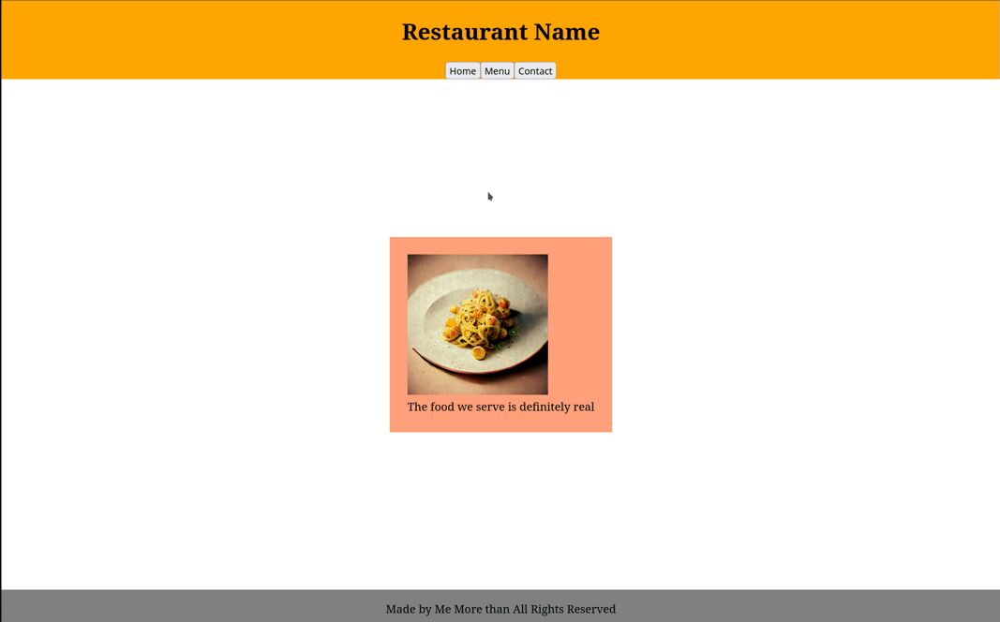

# Restaurant Page

Simple restaurant page using HTML, CSS, JavaScript and bundled with Webpack. The details of each 'tab' are stored as in <code>src/tabs.js</code> and the website's main section is refreshed and populated with the current tab's content via <code>src/website.js</code>. For the menu page, the food items are returned as objects in <code>src/food.js</code> allowing for simple additions or removals. 

Made for the Odin Project - assignment link <a href="https://www.theodinproject.com/lessons/node-path-javascript-restaurant-page">here</a>.

Live deployment available <a href="https://volfy.github.io/restaurant-odin/">here</a>.

### Asset notes:

**Food Images:** generated by <a href="https://www.midjourney.com/">Midjourney</a>'s AI.